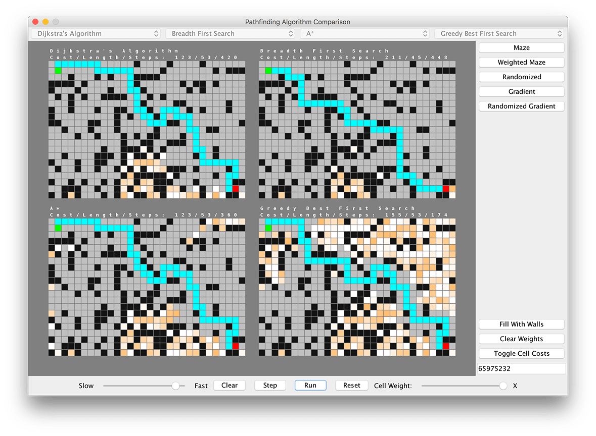
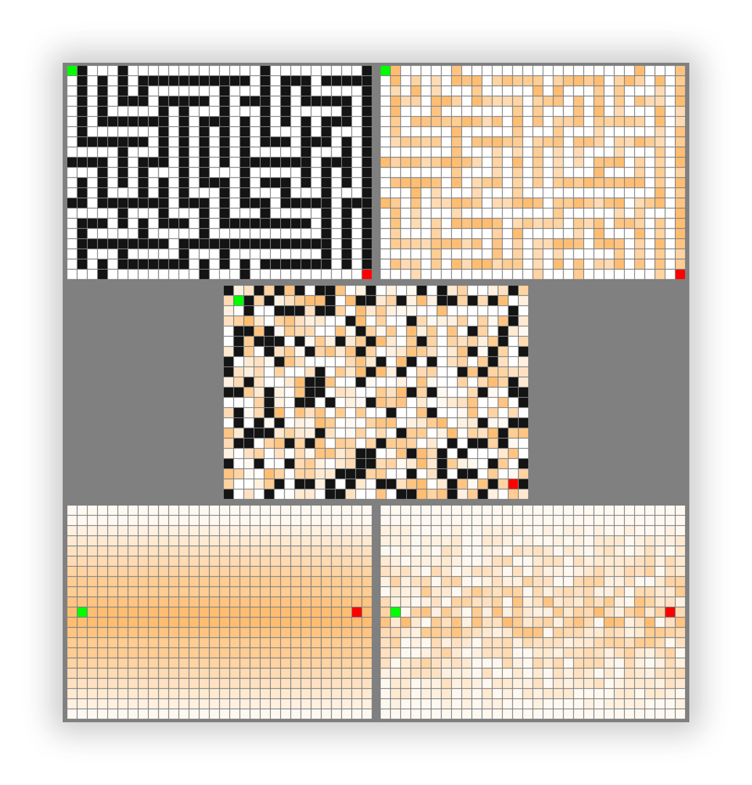

# Pathfinding Visual Comparison #

This project provides a visual side-by-side comparison of several common
pathfinding algorithms.

## Overview ##
The comparison window consists of several grids, each displaying the execution
of one algorithm. These grids can be edited by clicking and dragging on their contents,
with changes being synchronized across all grids.

Buttons at the bottom of the window can be used to play an animation of all algorithms
running, advance each algorithm a single step, or clear/reset the grids.

**Features include:**

* Comparing multiple algorithms side-by-side in one window
* Grid editing: Placing obstacles and moving start and target points to create custom scenarios
* Weighted graphs: Adding a travel cost to certain cells
* Preset setups (seedable):
    * Mazes
    * Randomized grids
    * Weighted gradients
* Step-by-step viewing of algorithm procedure
* Adjustable run speed

**Included Algorithms:**

* [Dijkstra's Algorithm](https://en.wikipedia.org/wiki/Dijkstra%27s_algorithm)
* [A* Search](https://en.wikipedia.org/wiki/A*_search_algorithm) (2 variants)
* [Breadth First Search](https://en.wikipedia.org/wiki/Breadth-first_search)

## Presets ##

## License ##
This project is licensed under the MIT license. See [LICENSE](LICENSE) for details.
